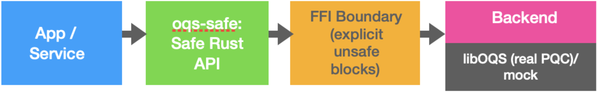

# oqs-safe

[](https://crates.io/crates/oqs-safe)
[](https://github.com/0rlych1kk4/oqs-safe-0/releases)
[](https://docs.rs/oqs-safe)
[](LICENSE-MIT)  
[](https://github.com/0rlych1kk4/oqs-safe-0/actions/workflows/ci.yml)

---
## Architecture



##  oqs-safe v0.6.1

**oqs-safe** is a **production-oriented Post-Quantum Cryptography (PQC) toolkit in Rust**, built on top of [libOQS].

It provides safe, minimal abstractions for:
- Post-quantum key exchange (ML-KEM)
- Post-quantum signatures (ML-DSA)
- Hybrid cryptography (classical + PQC)
- Secure session key derivation

> Zeroizes secrets • Safe newtypes • Hybrid-ready • Migration-focused

---

##  Features

###  Post-Quantum Algorithms

- **KEM:**  
  - ML-KEM-512  
  - ML-KEM-768  
  - ML-KEM-1024  

- **Signatures:**  
  - ML-DSA-44  
  - ML-DSA-65  
  - ML-DSA-87  

---

###  Hybrid Cryptography (NEW)

Supports **hybrid key exchange** combining:

- Classical cryptography: **X25519**
- Post-quantum cryptography: **ML-KEM**

 This is the **recommended real-world migration approach**.

- HKDF-based secret derivation
- Domain separation
- Zeroized secrets

---

###  Secure Session Derivation (NEW)

- `SecureSession` abstraction
- Derive symmetric keys from shared secrets
- Client/server key separation

---
### Handshake Transcript Binding (Introduced in v0.6.0)

The hybrid handshake now binds session derivation to a transcript hash covering:

- selected KEM algorithm
- client X25519 public key
- client ML-KEM public key
- server X25519 public key
- ML-KEM ciphertext

This helps both sides derive the final session key from the same exchanged handshake messages.
---
### Optional Handshake Serialization (Introduced in v0.6.0)

Enable the `serialization` feature to serialize and deserialize handshake messages:

```toml
oqs-safe = { version = "0.6", features = ["serialization"] }
```
Supported helpers:

- ClientHello::to_bytes()
- ClientHello::from_bytes()
- ServerHello::to_bytes()
- ServerHello::from_bytes()
---

### Optional AEAD Secure Session Helpers (Introduced in v0.6.0)

Enable the `aead` feature to use ChaCha20Poly1305 helpers from `SecureSession`:

```toml
oqs-safe = { version = "0.6", features = ["aead"] }
```
Supported helpers:
- SecureSession::encrypt()
- SecureSession::decrypt()

The AEAD key is derived from the session master secret using HKDF with a dedicated label.

## Authenticated Hybrid Handshake (Introduced in v0.7.0)

`oqs-safe v0.7.0` includes an authenticated hybrid handshake example for post-quantum migration scenarios.

The example combines:

- X25519 classical key exchange
- ML-KEM post-quantum key exchange
- ML-DSA transcript signing and verification
- Transcript-bound hybrid secret derivation
- HKDF directional session keys

Run it with:

```bash
cargo run --example authenticated_hybrid_handshake

### ️ Backends

- **Mock backend (default)**  
  - No native dependencies  
  - Fast CI/testing  

- **liboqs backend**  
  - Real PQC operations  
  - Production-like testing  

---

## Install

### 1. Add the crate

- **Default (mock backend for CI/dev):**
  ```toml
  oqs-safe = { version = "0.6", features = ["ml_kem_768", "ml_dsa_44"] }

- **Production (real liboqs backend):**

  oqs-safe = { version = "0.6", default-features = false, features = ["liboqs", "ml_kem_768", "ml_dsa_44"] }

### 2. (Prod only) Install libOQS

```rust
  git clone https://github.com/open-quantum-safe/liboqs
  cd liboqs && mkdir build && cd build
  cmake -G Ninja -DCMAKE_BUILD_TYPE=Release -DOQS_DIST_BUILD=ON -DBUILD_SHARED_LIBS=ON -DCMAKE_INSTALL_PREFIX="$HOME/.local/liboqs" ..
  ninja && ninja install
```
- **Make oqs-safe find and load liboqs:**
```rust  
  export LIBOQS_DIR="$HOME/.local/liboqs"
```
- **macOS: ensure runtime linking finds liboqs.dylib:**
```rust  
  export DYLD_FALLBACK_LIBRARY_PATH="$HOME/.local/liboqs/lib:${DYLD_FALLBACK_LIBRARY_PATH}"
```
- **Optional: pkg-config:**
```rust
  export PKG_CONFIG_PATH="$HOME/.local/liboqs/lib/pkgconfig:${PKG_CONFIG_PATH}"
```
## Quickstart

### Hybrid Handshake API

`oqs-safe v0.6.1` introduces a TLS-style hybrid handshake abstraction with transcript-bound session derivation.

The API combines:

- X25519 classical key exchange
- ML-KEM post-quantum encapsulation
- HKDF-based hybrid secret derivation
- Client/server session key separation

```rust
use oqs_safe::handshake::{HybridClient, HybridServer};

let mut client = HybridClient::new();
let client_hello = client.start_handshake()?;

let mut server = HybridServer::new();
let server_hello = server.respond(client_hello)?;

let client_session = client.finish(server_hello)?;
let server_session = server.session()?;

let (client_send_key, client_recv_key) = client_session.derive_client_server_keys();
let (server_send_key, server_recv_key) = server_session.derive_client_server_keys();

assert_eq!(client_send_key, server_send_key);
assert_eq!(client_recv_key, server_recv_key);
```
### ML-KEM Key Exchange
```rust
   use oqs_safe::kem::{Kem, KemAlgorithm, KemInstance};

   let kem = KemInstance::new(KemAlgorithm::MlKem768);
   let (pk, sk) = kem.keypair()?;
   let (ct, ss1) = kem.encapsulate(&pk)?;
   let ss2 = kem.decapsulate(&ct, &sk)?;
   assert_eq!(ss1.len(), ss2.len());
```
### ML-DSA Sign & Verify
```rust
  use oqs_safe::sig::{SigAlgorithm, SigInstance, SignatureScheme};
  let sig = SigInstance::new(SigAlgorithm::MlDsa44);
  let (pk, sk) = sig.keypair()?;
  let msg = b"hello pqc";
  let signature = sig.sign(&sk, msg)?;
  sig.verify(&pk, msg, &signature)?;
```
### Hybrid X25519 + ML-KEM

```rust
cargo run --example hybrid_x25519_mlkem
```
- **This demonstrates:**
- **Classical X25519 key exchange**
- **ML-KEM encapsulation**
- **HKDF-based hybrid secret derivation**

### Derive session keys

```rust
   use oqs_safe::session::SecureSession;

   let session = SecureSession::new(shared_secret);

   let (client_key, server_key) = session.derive_client_server_keys();
``` 
---
## Examples

- **Mock backend:**
```bash
cargo run --example kem_roundtrip --features "ml_kem_768"
cargo run --example dsa_sign_verify --features "ml_dsa_44"
cargo run --example authenticated_hybrid_handshake
cargo run --example hybrid_x25519_mlkem
```

- **Real backend:**
```bash
cargo run --example kem_roundtrip --features "liboqs,ml_kem_768"
cargo run --example dsa_sign_verify --features "liboqs,ml_dsa_44"
cargo run --example hybrid_x25519_mlkem --features "liboqs"
cargo run --example authenticated_hybrid_handshake --features "liboqs"
```
---
## Testing

```bash
cargo test
cargo test --features "serialization"
cargo test --features "aead"
cargo test --features "serialization,aead"
cargo test --features "liboqs"
```
---
## Security Notes
- **Always derive keys via HKDF before use**
- **Hybrid handshake transcript binding is enabled in the handshake API**
- **Application-level identity authentication is still required**
- **Hybrid crypto does NOT replace authentication**
- **Secrets are zeroized on drop**
- **Avoid logging or serializing secrets**
- **This crate is not formally audited**
---
## Migration Guidance
- **For real-world deployments:**
- **Use hybrid X25519 + ML-KEM**
- **Do NOT rely on PQC-only yet**
- **Add authentication (TLS, signatures, etc.)**
- **Protect against downgrade attacks** 
---
## MSRV & License

- **MSRV: Rust 1.70+:**
---
## License: MIT OR Apache-2.0
---
## Acknowledgements
- **Built on [libOQS] from the Open Quantum Safe project**
- **Designed for real-world PQC migration scenarios**
---
## Contributing
- **Contributions welcome for:**
- **Additional PQC algorithms**
- **TLS-style handshake patterns**
- **HSM / enclave integrations**
- **Blockchain / wallet integrations**
---
